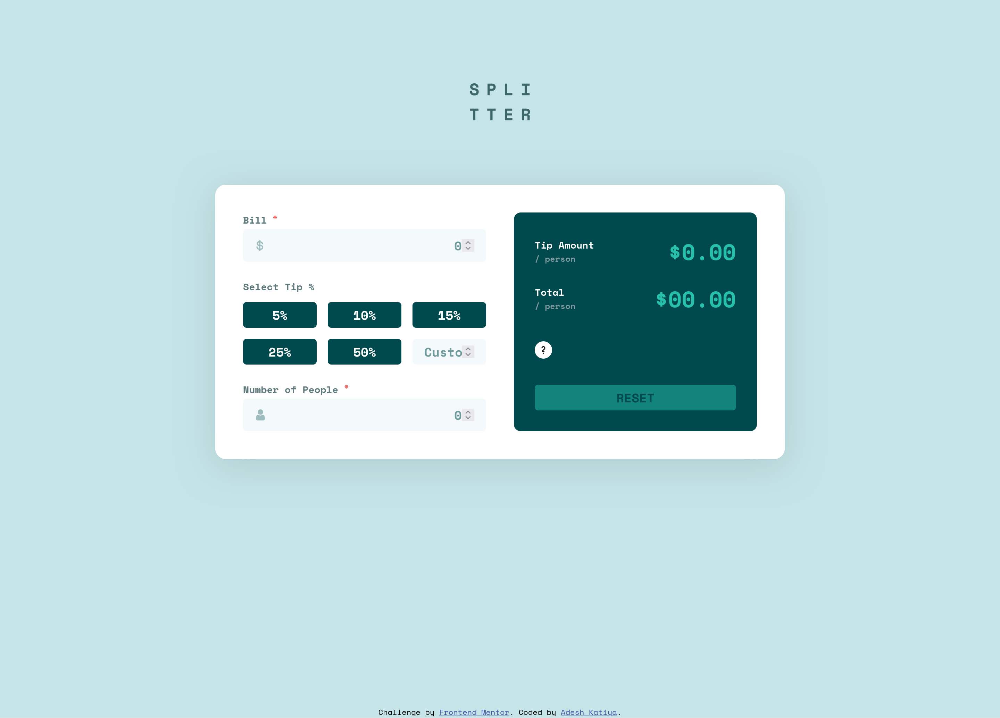

# Frontend Mentor - Tip calculator app solution

This is a solution to the [Tip calculator app challenge on Frontend Mentor](https://www.frontendmentor.io/challenges/tip-calculator-app-ugJNGbJUX). Frontend Mentor challenges help you improve your coding skills by building realistic projects.

## Table of contents

- [Overview](#overview)
  - [The challenge](#the-challenge)
  - [Screenshot](#screenshot)
  - [Links](#links)
- [My process](#my-process)
  - [Built with](#built-with)
  - [What I learned](#what-i-learned)
  - [Continued development](#continued-development)
  - [Useful resources](#useful-resources)

## Overview

### The challenge

Users should be able to:

- View the optimal layout for the app depending on their device's screen size
- See hover states for all interactive elements on the page
- Calculate the correct tip and total cost of the bill per person

### Screenshot

### Links

- Solution URL: [Tip Calculator App](https://www.frontendmentor.io/solutions/responsive-tip-calculator-built-with-sassbem-and-vanilla-js-vite-LCGcRAeJRL)
- Live Site URL: [Tip Calculator App](https://fem-tip-calculator-app-lake.vercel.app/)

## My process

### Built with

- Semantic HTML5 markup
- CSS custom properties
- Flexbox
- CSS Grid
- Mobile-first workflow
- [Vite](https://vite.dev/guide/) - for build tool

### What I learned

- Learned about how to handle different user events efficienlty.
- Learned about how to style form elements.
- Learned about waiting for user entered inputs efficiently (not executing code on every input).

### Continued development

- Learning about how to distribute code into different modules.
- Learning about accessability and UX enhancement techniques.

### Useful resources

- [Stack Overflow](https://www.stackoverflow.com) - Generic queries.
